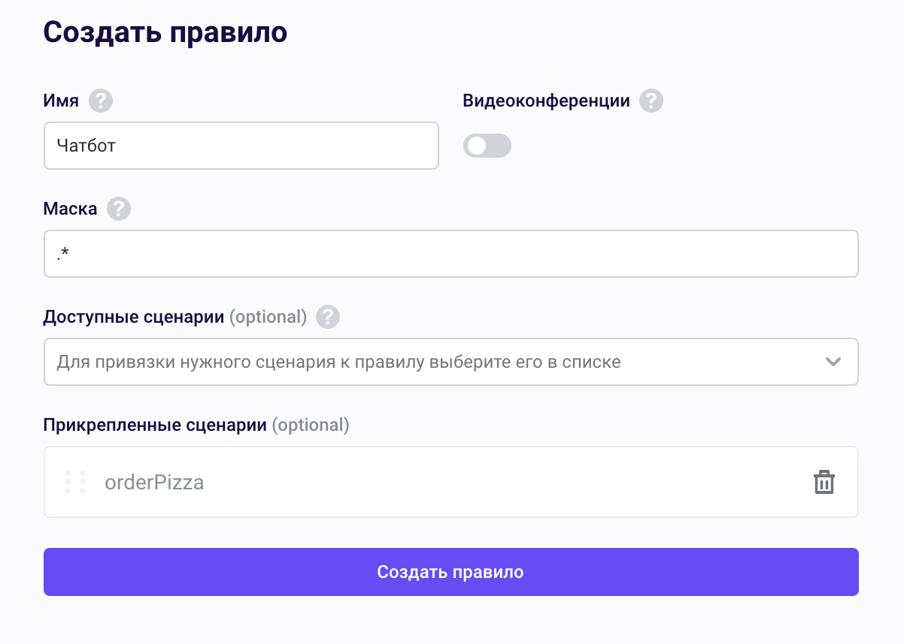
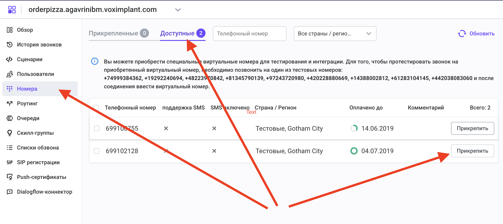

# Лабораторная работа №2. Интеграция Watson Assistant и телефонии с использованием voximplant

* [Лабораторная работа №2. Интеграция Watson Assistant и телефонии с использованием voximplant](#лабораторная-работа-2-интеграция-watson-assistant-и-телефонии-с-использованием-voximplant)
   * [1. Настройка Voximplant](#1-настройка-voximplant)
      * [1.1. Создадим приложение "orderPizza"](#11-создадим-приложение-orderpizza)
      * [1.2. Создадим сценарий "orderPizza"](#12-создадим-сценарий-orderpizza)
      * [1.3. Создадим правило "ЧатБот"](#13-создадим-правило-чатбот)
      * [1.4. Подключим телефонный номер](#14-подключим-телефонный-номер)
      * [1.5. Привяжите телефонный номер к приложению](#15-привяжите-телефонный-номер-к-приложению)
   * [2. Протестируйте бота](#2-протестируйте-бота)

## 1. Настройка Voximplant

Зарегистрируйтесь в voximplant:
https://voximplant.com/sign-up

Добавьте промокод, предоставленный партнером.

https://manage.voximplant.com/billing/pay_method/promocode


### 1.1. Создадим приложение "orderPizza"

Создайте приложение **orderPizza** (Приложения - Создать приложение)


### 1.2. Создадим сценарий "orderPizza"

Откройте созданное приложение и перейдите в секцию "Сценарии". Создайте сценарий для обработки звонка (кнопка +)
Текст сценария - см. внизу. Обратите внимание - значение переменной **workspaceId** должно быть скопированы из Вашей конфигурации Watson Assistant (Skills - IBMPizzaBot - View API details - Workspace ID).
Также укажите username, password и serviceURL.

Список поддерживаемых языков:
- Синтез речи (text-to-speech):
  - <a href="https://voximplant.com/docs/references/voxengine/language">Базовый список языков синтеза речи</a>
  - <a href="https://voximplant.com/docs/references/voxengine/premium">Premium список языков синтеза речи</a>


- Распознавание речи:
  - <a href="https://voximplant.com/docs/references/voxengine/asr/asrlanguage">Базовый список языков для распознавания</a>


```
// Эти переменные необходимо указать с использованием Ваших данных - откройте раздел Credentials в Вашем аккаунте Watson Assistant:
var assistantId=""; //ASSISTANT_ID
var username="apikey";
var password=""; //APIKEY
var assistantURL="https://api.eu-gb.assistant.watson.cloud.ibm.com/instances/.../v2/assistants/"; //ASSISTANT_URL
```

Текст сценария:

```
require(Modules.ASR);

let watson_assistant_sessionID;
VoxEngine.addEventListener(AppEvents.Started, sessionId_request);

var myJSONdata;
// -------
// Эти переменные необходимо указать с использованием Ваших данных - откройте раздел Credentials в Вашем аккаунте Watson Assistant:
var assistantId=""; //ASSISTANT_ID
var username="apikey";
var password=""; //APIKEY
var assistantURL="https://api.eu-gb.assistant.watson.cloud.ibm.com/instances/.../v2/assistants/"; //ASSISTANT_URL
contextObject={};
var myasr;

VoxEngine.addEventListener(AppEvents.CallAlerting, function (e){
  call = e.call;
  call.addEventListener(CallEvents.Connected, onCallConnected);
  call.addEventListener(CallEvents.Disconnected, VoxEngine.terminate);
  call.answer();
});

function onCallConnected(callevent){
  myasr = VoxEngine.createASR({ lang: ASRLanguage.RUSSIAN_RU });
  myasr.addEventListener(ASREvents.Result, function(e){
    var userSpeech = e.text;
    sendToBot(userSpeech);
  });
  myasr.addEventListener(ASREvents.SpeechCaptured, function(e){
    call.stopMediaTo(myasr);
  });
  call.say("Привет!", Language.Premium.RU_RUSSIAN_YA_FEMALE);
  call.addEventListener(CallEvents.PlaybackFinished, function(e){
    call.removeEventListener(CallEvents.PlaybackFinished);
    call.sendMediaTo(myasr);
  });
}

function sendToBot(text) {
    var serviceURL=assistantURL+
      assistantId+"/sessions/"+watson_assistant_sessionID+"/message?version=2019-02-28"
    var base64header=base64_encode(username+":"+password);
    authorizationHeader="Authorization: Basic "+base64header;

    Logger.write(serviceURL);
    var inputObject={"input":{"text":text},"context":contextObject};
    Logger.write("inputObject: "+JSON.stringify(inputObject));
    var opts = { headers: ["Content-Type: application/json;charset=utf-8",
                       authorizationHeader,
                       "Accept: application/json"
                      ],
                  method: "POST",
                  postData: JSON.stringify(inputObject),
                  rawOutput: true 
                  };
    Net.httpRequestAsync(serviceURL, opts)
      .then(function (result){
        var myJSONdata;
        if(result.code == 200) {
          Logger.write("Connected successfully");
          myJSONdata=JSON.parse(result.text);
        } else {
          Logger.write("Unable to connect");
        }
        contextObject=myJSONdata.context;
        combinedText='';
        if (myJSONdata.output.generic[0].text){
          for (index = 0; index < myJSONdata.output.generic.length; ++index) {
            combinedText=combinedText+myJSONdata.output.generic[index].text;
          }
        } else {
          combinedText += myJSONdata.output.generic[0].title;
        }
        if (contextObject && contextObject.status == "hangup") {
            mycall.addEventListener(CallEvents.PlaybackFinished, function(callevent) {
             mycall.hangup(); // <--  несмотря на отсутствие звонков сессия не завершится
            })
        } else {
        call.say(combinedText, Language.Premium.RU_RUSSIAN_YA_FEMALE);
        call.addEventListener(CallEvents.PlaybackFinished, function(e){
          call.removeEventListener(CallEvents.PlaybackFinished);
          call.sendMediaTo(myasr);
        });
        }
      });
}

function sessionId_request() {
    var myJSONdata;
    var serviceURL=assistantURL+assistantId+"/sessions?version=2019-02-28";
    var base64header=base64_encode(username+":"+password);
    authorizationHeader="Authorization: Basic "+base64header;
    Logger.write(serviceURL);
    var opts={headers: authorizationHeader,
            method: "POST",
            rawOutput: true };
    Net.httpRequest(serviceURL, handle_sessionId_request, opts);
}

 function handle_sessionId_request(e) {
    var myJSONdata;
    //Logger.write("e: "+e);
    myJSONdata=JSON.parse(e.text);
    combinedText = myJSONdata.session_id;
    Logger.write("SessionID: " + combinedText);
    watson_assistant_sessionID = combinedText;
} 
```

### 1.3. Создадим правило "ЧатБот"

Перейдите в секцию "Роутинг" вашего приложения и создайте новое правило **ЧатБот**

Добавьте сценарий **orderPizza** в правило **ЧатБот**:



Сохраните Ваше приложение

### 1.4. Подключим телефонный номер

Приобретите тестовый телефонный номер, к которому будет привязан Ваш чат-бот. Позднее Вы сможете приобрести реальный телефонный номер и использовать его после верификации.
Для заказа тестового номера:
- войдите в меню **Номера**
- нажмите **Купить телефонный номер**
- выберите категорию **Тестовые номера**
- выберите номер телефона из списка и добавьте его в конфигурацию

### 1.5. Привяжите телефонный номер к приложению

Откройте настройки Вашего приложения, и перейдите в раздел **Номера**.
В категории **Доступные** нажмите **Прикрепить** напротив номера, который Вы хотите присоединить к приложению.



## 2. Протестируйте бота

Позвоните по Вашему телефонному номеру. Вам должен ответить бот:
"Здравствуйте! Вы позвонили в сервис заказа пиццы."

Вы можете также использовать тестовый softphone для проверки сценария:
https://dialer.voximplant.com/app/softphone

Для его использования необходимо:
1. Добавить пользователя в настройки приложения orderPizza (Пользователи - Создать - ввести имя/пароль - Создать)
2. Ввести необходимые данные в окне <a href="https://dialer.voximplant.com/app/softphone">softphone</a>:
  - имя/пароль созданного пользователя
  - имя приложения (orderpizza)
  - имя аккаунта, под которым Вы зарегистрировались

Поздравляем! Вы создали голосового помощника. Попробуйте поговорить с ботом.
