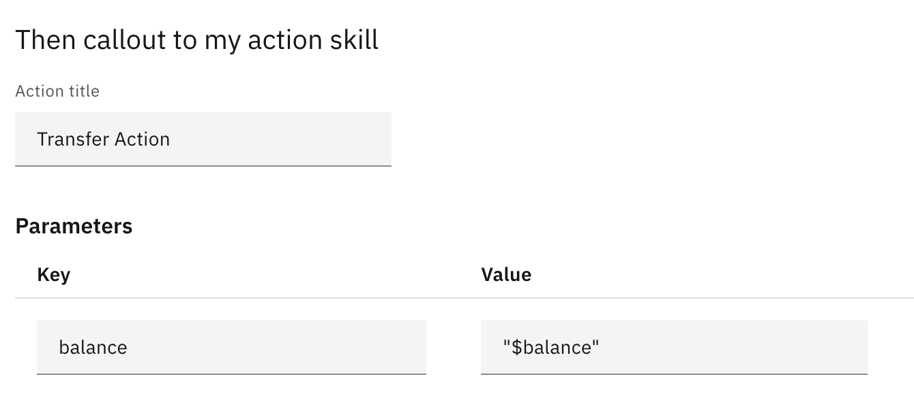

## 3. Watson Assistant Actions Skills lab

Table of Contents
* [1. Create WA instance](#1-create-wa-instance)
* [2. Import Banking Dialog Skill](#2-import-banking-dialog-skill)
* [3. Create Banking Assistant with Banking Actions skill](#3-create-banking-assistant)
* [4. Configure Banking Actions Skill](#4-create-actions-skill)
* [5. Integrate Dialog skill with Action Skill](#5-integrate-dialog-skill-with-action-skill)
* [6. Integrate Dialog skill with webhook](#6-integrate-dialog-skill-with-webhook)
* [7. Test your new assistant](#7-test-your-new-assistant)

## 1. Create WA instance

1.1. Go to https://cloud.ibm.com. Create a new Watson Assistant instance (Catalog - Services - AI / Machine Learning - Watson Assistant):

1.2. In the instance - select region closest to you (we will use **Frankfurt**), select **Trial** plan, enter Service name as "**Watson Assistant - Lab**" and click "Create":

1.3. Push **Launch Watson Assistant** button.

## 2. Import Banking Dialog Skill

2.1. Click on **Skills** at the top left corner to see list of skills available

2.2. Download banking dialog skill from <a href="https://github.com/agavrin/WatsonAssistantRus/raw/master/skills/skill-BankingBotRus.json">Github</a>. Click **Create Skill** button. Select **Dialog Skill**, click Next. Click **Upload Skill**. Select the downloaded file, click **Upload**.

2.3. Go to Dialog menu, explore the choices available. Click "Try it" button, try to enter a few questions into the test widget:
*   `hello, how are you?` (expected response: Hello, welcome to ABC bank!)
*   `I lost my card` (expected response: Report missing card)

## 3. Create Banking Assistant with Banking Actions skill

3.1. Click on the Assistants link at the top left corner. Click **Create Assistant**:

3.2. Give your assistant a name of **Banking Assistant**. Click **Create assistant**:

3.3. Add your banking Dialog Skill to the assistant (Add Dialog Skill - Banking-Dialog-EN)

3.4. Click "Add an Actions skill" button. Give your new Actions skill a name **Banking Actions Skill** and click **Create actions skill**.

3.5. Your banking assistant is now ready with two Skills (Dialog skill and empty yet Actions skill). Click on the **Add integration** - **Preview** and bookmark your Preview URL.

3.6. Close your preview config page (top right X). You are now ready to create your actions.

## 4. Configure Banking Actions Skill

4.1. Click on the Banking Actions Skill. Click **Create a new Action** button.

4.2. Give the action a name of "**Transfer Action**" at the top left corner.

4.3. Add a few examples to the "Training Examples" section, such as:

*   `transfer money`
*   `I would like to transfer funds`

4.3. Click on the first step on the left. For "Assistant says" enter the message: **Your balance:**. Keep it as is for now and create step 2.

4.4. Create step 2: **How much you would like to transfer?** Select **Number** as customer response:

4.5. For step 3 - enter condition as below and text **You cannot transfer less than $100.**

At the end of this step select "return to previous step" (step 2).

4.6. Create step 4. Click hamburger icon to the right of Step 4 and select Step options - set variable names. Create **balance** and **newbalance** variables.  

Set the value of variable **newbalance** to expression of **balance** - **amount of transfer** (you have to scroll down first to the end of the drop-down to choose **Expression** and prepend each variable with **$**):

Set the text of the step 4 to the following, and set the "And then" to **End the action**

4.7. Go back to step 1 and add **balance** variable to the text as follows:

4.8. Test your new Action skill:

*   `transfer money`
*   `10`
*   `1000`

Note that your balance is shown as null, as there is no integration with Dialog skill available yet. Let's integrate Actions skill with external service.

## 5. Integrate Dialog skill with Action Skill

5.1. Now let's change our Dialog nodes to connect to Actions skill. Go into the "Dialog" section and create a new folder, called "Transfer Money" with condition of #Banking_Transfer_Money. We will use it to store a few nodes, responsible for money transfer:

5.2. Move existing **Banking_Transfer_Money** node into that folder (by clicking the three dots menu and selecting **Move**):

5.3. Change the **Banking_Transfer_Money** node condition to a more complex condition (we will check if balance is greater than 0):

Change response to:
- Type = `Option`.
- Title: `Your balance is <? $balance ?>. Would you like to transfer?`
- Option 1: `Yes` (value=Yes)
- Option 2: `No` (value=No)

5.4. Add a child node to **Banking_Transfer_Money**. Give it a name of **call Transfer Action** and condition as #Bot_Control_Approve_Response. Turn disambiguation off for this node:

Click Customize, then select "Callout to webhooks/action skill":

Click Apply. Now you have to specify the Action Skill title in the node configuration. Also, add a balance parameter, so we pass over balance from Dialog to Action skill:

For the Actions Skill response we will need to store the new balance in $balance context variable and provide appropriate text to the user. Click on the gear icon near frist "Assistant responds" option, then open context editor (three dots near "Assistant Responds" section. Enter the following information (Variable: **balance**, Value: **$action_result_1.newbalance**, assistant response: **Transfer was successful!**):

At the end you should see something similar to:

## 6. Integrate Dialog skill with webhook

6.1. For the webhook example we will use a free service https://webhook.site/

Open https://webhook.site/ in your browser. You will be immediately given a temporary unique web service URL, such as the following:

Click Edit button at the top right corner of the web site, and type in

`{ "balance": 123000 }`

as **Response body**. Set **Content type** as **application/json** and click **Save**.

Keep this browser window open, so you can monitor requests coming to the service later on.

6.2. Open your **Banking-Dialog-EN** Dialog skill, created at step 2.2 and go to Options/Webhooks menu. Paste your webhook URL from 5.1 into the URL field:

6.3. Now let's add a node, which will call an external webhook and store balance retrieved from it, in a context variable. At the end it will jump to the Banking_Transfer_Money node.

Add a node below Banking_Transfer_Money:

Let's call it **Retrieve balance** with condition = **true** and disambiguation **off**.

Click on Customize and enable **callout to webhooks...** option, then click **Call a webhook**

At the end of the node it should Jump to Banking_Transfer_Money node and respond:

Enter the following as parameters to the same node response configuration:
Context: **balance** = **$webhook_result_1.balance**
Response text:
`Your balance retrieved: <? $balance ?>`

## 7. Test your new assistant

7.1. Go back to the Assistant assistant and click on the Preview link on the right:

7.2. Test your new assistant:

7.3. Please see the final Skills files available for you:
- <a href="./skills/skill-Banking-Actions-Skill.json">skill-Banking-Actions-Skill.json</a>
- <a href="./skills/skill-Banking-Dialog-Lab1.json">skill-Banking-Dialog-Lab1.json</a>
