# Лабораторная работа №7. Интеграция Watson Assistant и Telegram с использованием Node-red

  - [1. Установка Node-red](#1-установка-node-red)
  - [2. Развертывание сервисов Watson](#2-развертывание-сервисов-watson)
      - [2.1. Создайте сервис IBM Watson Assistant](#21-создайте-сервис-ibm-watson-assistant)
      - [2.2. Создайте сервис IBM Watson Visual Recognition](#22-создайте-сервис-ibm-watson-visual-recognition)
      - [2.3. Создайте сервис IBM Language Translator](#23-создайте-сервис-ibm-language-translator)
  - [3. Создадим бота Telegram](#3-создадим-бота-telegram)
  - [4. Сконфигурируем Node-RED](#4-сконфигурируем-node-red)
      - [4.1. Запуск Node-RED](#41-запуск-node-red)
      - [4.2. Импорт конфигурации](#42-импорт-конфигурации)
      - [4.3. Добавим конфигурацию Telegram к Node-RED](#43-добавим-конфигурацию-telegram-к-node-red)
      - [4.4. Сконфигурируем сервис Telegram в Node-RED](#44-сконфигурируем-сервис-telegram-в-node-red)
      - [4.5. Сконфигурируем подключение к сервису IBM Watson Assistant в Node-RED](#45-сконфигурируем-подключение-к-сервису-ibm-watson-assistant-в-node-red)
      - [4.6. Сконфигурируем подключение к сервису Watson Visual Recognition в Node-RED](#46-сконфигурируем-подключение-к-сервису-watson-visual-recognition-в-node-red)
      - [4.7. Сконфигурируем сервис Language Translator в Node-RED](#47-сконфигурируем-сервис-language-translator-в-node-red)
  - [5. Протестируем бота](#5-протестируем-бота)

## 1. Установка Node-red

Зайдите в Ваш каталог сервисов IBM Cloud
https://console.bluemix.net/catalog/

Наберите "node-red" в поле поиска catalog

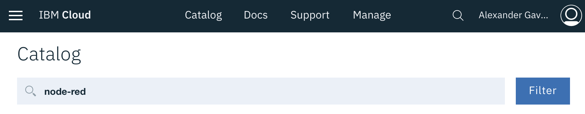

Нажмите "Node-RED Starter"

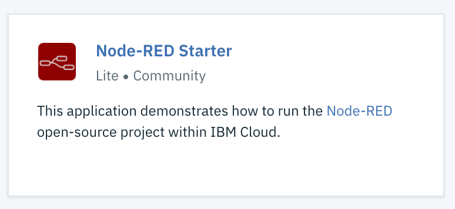

Введите имя для сервиса Node-RED (должно быть уникально) в поле App name:

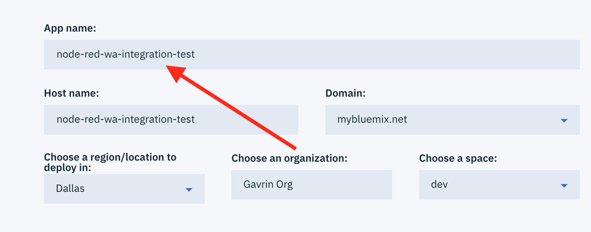

Оставьте остальные поля без изменения и нажмите кнопку Create. Вы увидите, что сервис начнет развертывание:

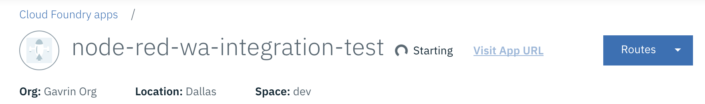

Пока сервис продолжает развертывание, продолжите создание других необходимых сервисов. Вы можете контролировать процесс развертывания с помощью секции Logs:

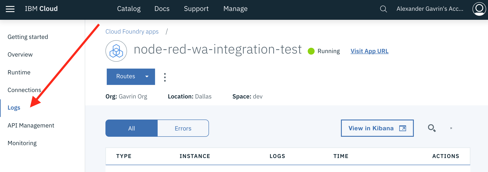

## 2. Развертывание сервисов Watson
Нам понадобятся следующие сервисы Watson:
- IBM Watson Assistant
- IBM Watson Visual Recognition
- IBM Language Translator

### 2.1. Создайте сервис IBM Watson Assistant
Откройте экран конфигурации IBM Watson Assistant (созданного ранее)
Импортируйте файл созданного бота: <a href="https://raw.githubusercontent.com/agavrin/WatsonAssistantRus/master/files/IBMPizzaTestBot.js">IBMPizzaTestBot.js</a>

(На вкладке Skills - Create - Import)

Сохраните значения API Key и Url этого бота.

### 2.2. Создайте сервис IBM Watson Visual Recognition
Зайдите в Ваш каталог сервисов IBM Cloud
https://console.bluemix.net/catalog/

Выберите категорию AI - Visual Recognition
Придумайте Service name (например, **MyVisualRecognition**), или оставьте как есть.
Нажмите Create.

На экране сервиса Появится секция "Credentials" на закладке "manage". Сохраните эти значения (API Key и URL).

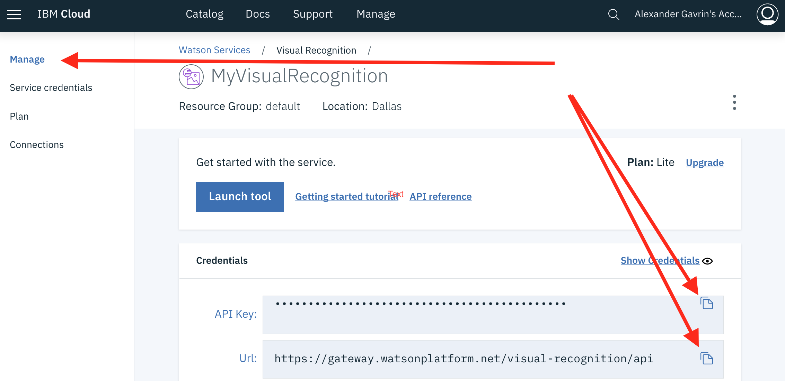

### 2.3. Создайте сервис IBM Language Translator
Зайдите в Ваш каталог сервисов IBM Cloud
https://console.bluemix.net/catalog/

Выберите категорию AI - Language Translator
Придумайте Service name (например, **MyLanguageTranslator**), или оставьте как есть.
Нажмите Create.

Вы будете перенаправлены на общую страницу списка сервисов. Теперь нажмите на сервис и сохраните API Key и Url:

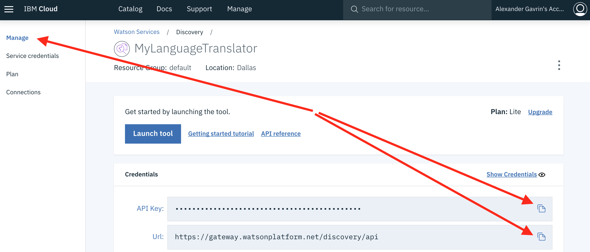

## 3. Создадим бота Telegram
Для создания бота:
- откройте ваше приложение Telegram и найдите в нем бота под названием "BotFather". Отправьте ему команду "/newbot".
- придумайте название для своего бота и отправьте его в ответ BotFather. В ответ придет сообщение с токеном - это ключ для доступа к вашему боту. Сохраните этот ключ (отправьте его, например, себе по электронной почте) - он понадобится для конфигурации позже.

## 4. Сконфигурируем Node-RED

## 4.1. Запуск Node-RED

Перейдите в Ваш список сервисов IBM Cloud:
https://console.bluemix.net/dashboard/apps
Найдите в списке сервисов сервис Node-RED, который был создан на шаге 1. Нажмите на него.
Убедитесь, что сервис запущен (Статус = Running).

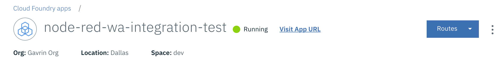

Опционально: Для увеличения количества памяти для приложения можно запросить промо-купон по адресу https://www.ibm.biz/ibmcloudcoupon После получения купона:
Установите на вкладке Runtime значение MB MEMORY PER INSTANCE в 512 MB. Нажмите Save.
Подождите пока приложение перезапустится.

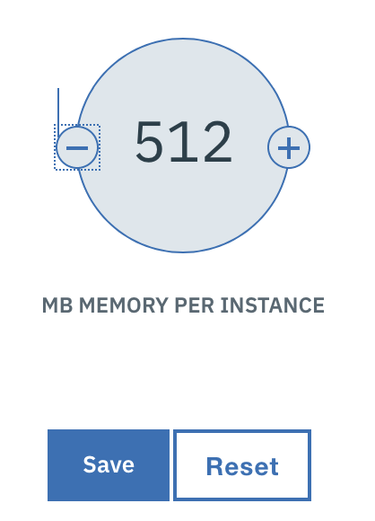

Нажмите ссылку "Visit App URL"

Вы попали на страницу конфигурации Node-RED. Нажмите Next.
Придумайте и введите имя пользователя и пароль для доступа к конфигурации сервиса.

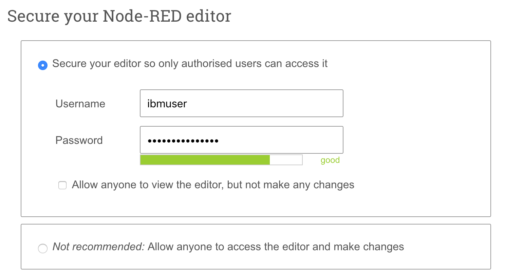

Нажмите Next - Next - Finish.

Нажмите кнопку Go to your Node-RED flow editor

Введите имя и пароль

Вы увидите экран конфигурации Node-RED

## 4.2. Импорт конфигурации

Откройте файл в текстовом редакторе:
<a href="//raw.githubusercontent.com/agavrin/WatsonAssistantRus/master/files/IBMPizzaTestBot.js">ссылка</a>

Сохраните текст файла в Clipboard (Ctrl-A - Ctrl-C)

Перейдите на экран конфигурации Node-RED

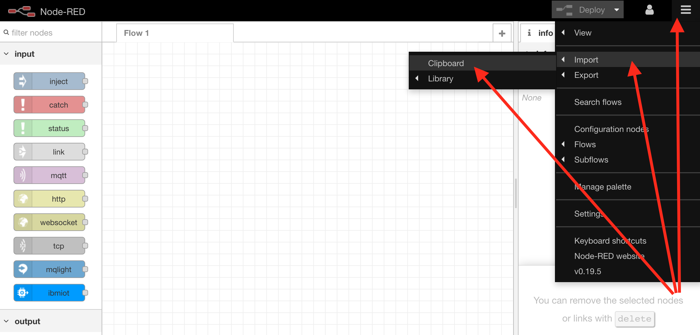

Вставьте конфикурацию в окно.

Ваш Node-RED должен импортировать конфигурацию и Вы увидите сообщение об ошибке:

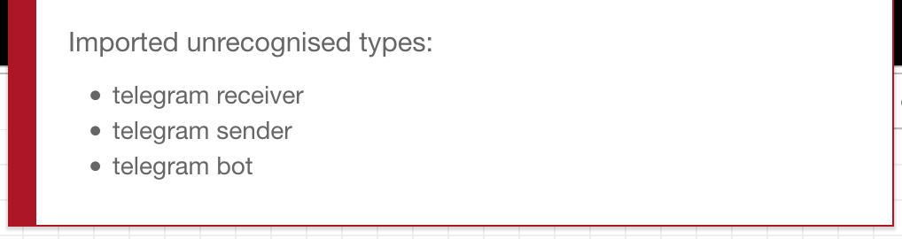

Это нормально, так как блоки для конфигурации Telegram еще не установлены в систему. Сделаем это.

## 4.3. Добавим конфигурацию Telegram к Node-RED

Manage Palette - Install
Наберите "telegram" в поле для поиска.

Вы увидите несколько пакетов для поддержки telegram - выберем node-red-contrib-telegrambot:

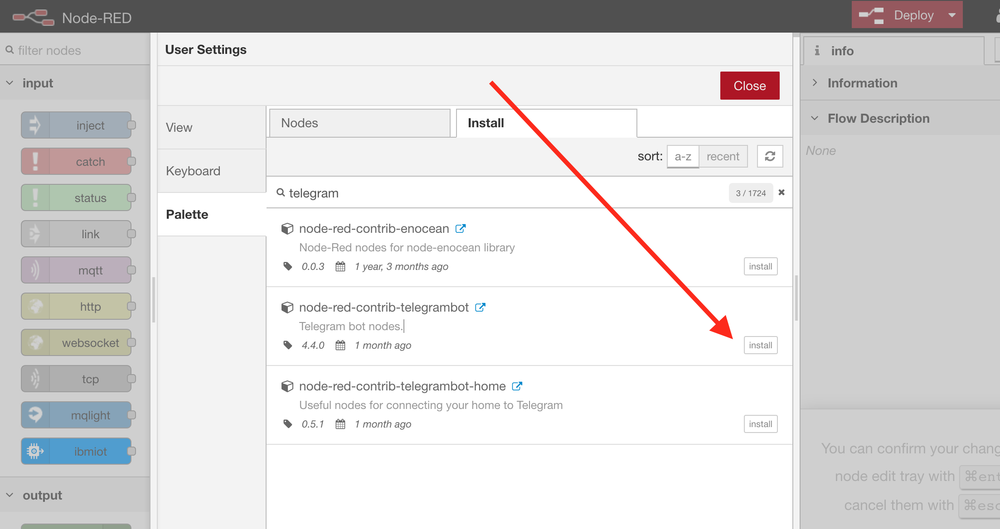

Нажмите "Install"

После завершения инсталляции блок "Telegram receiver" должен появиться на рабочей панели (в синем цвете)

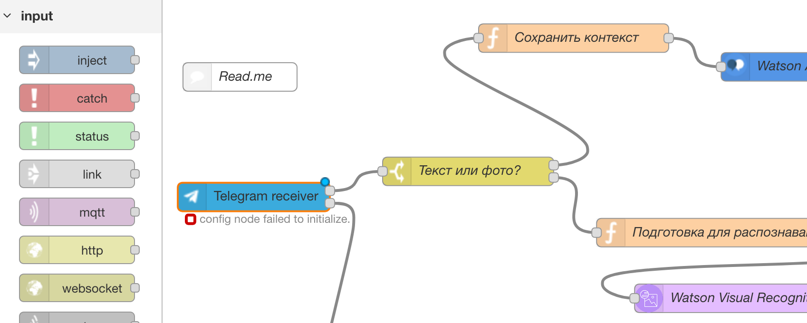

## 4.4. Сконфигурируем сервис Telegram в Node-RED

Нажмите на Telegram Receiver. Рядом с названием PizzaBot нажните на значок редактирования и введите API Token от телеграм бота в окне Token:

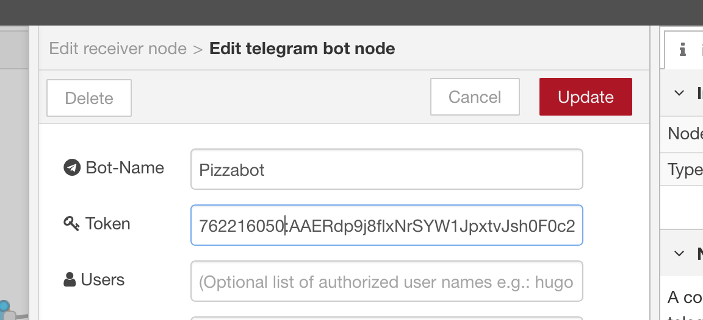

Сделайте то же самое для Telegram Sender, Нажмите Update и Deploy (в правом верхнем углу).

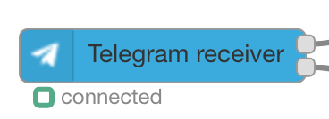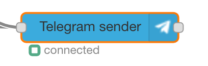

## 4.5. Сконфигурируем подключение к сервису IBM Watson Assistant в Node-RED

Нажмите на блок Watson Assistant

Вам нужно ввести:
- Username
- Password
- Workspace ID

Проверьте gateway - он должен совпадать с тем, что указан в сервисе

Нажмите Done

## 4.6. Сконфигурируем подключение к сервису Watson Visual Recognition в Node-RED

Нажмите на блок Watson Visual Recognition

Вам нужно ввести:
- API Key

Выберите соответствующий endpoint (из конфигурации сервиса)

Нажмите Done

## 4.7. Сконфигурируем сервис Language Translator в Node-RED

Нажмите на блок translator

Вам нужно ввести:
- Username
- Password

- Use Default Service Endpoint - отключите опцию и добавьте свой из сервиса Language Translator
Проверьте gateway - он должен совпадать с тем, что указан в сервисе

Проверьте:

- Use Experimental Neural Translation - включено
- Domains: General
- Source: English
- Target: Russian
- Not using translation utility

Нажмите Done

## 5. Протестируем бота

Попробуйте обратиться к Вашему боту через приложение telegram.

Пример вопроса:
"Хочу пиццу"
"хочу большую сырную пиццу с анчоусами и оливками"

Отправьте фотографию какого-нибудь объекта. Watson распознает объект и вернет его название на Русском языке.
