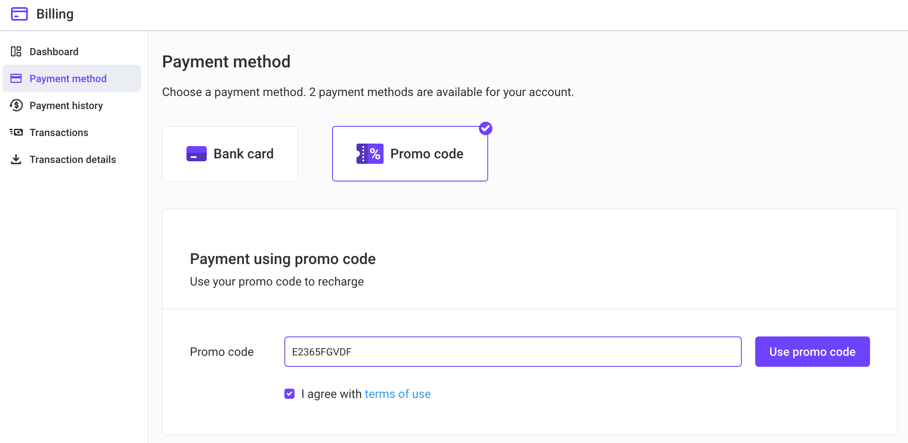
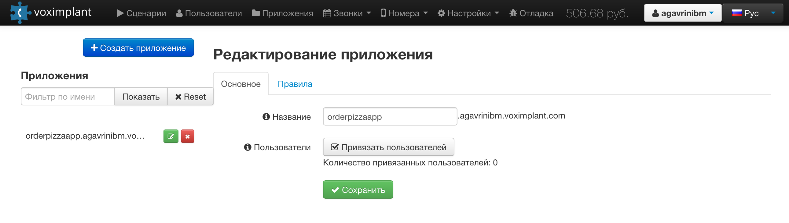
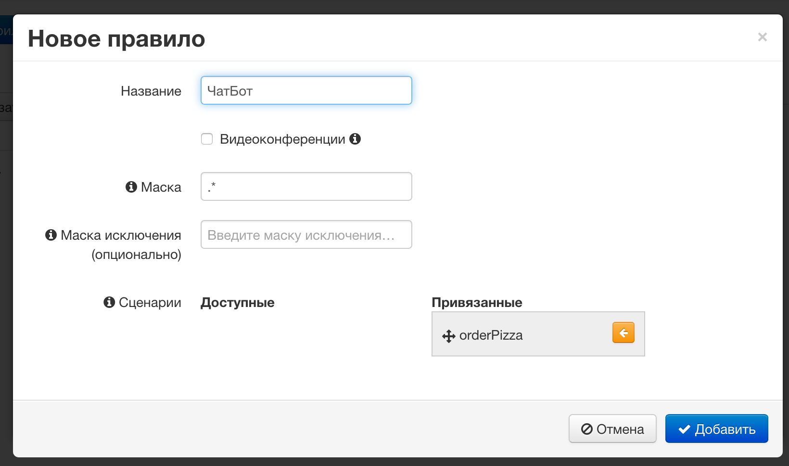
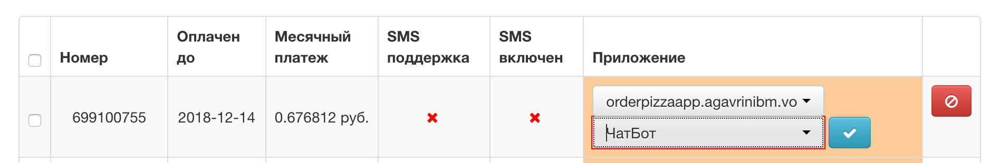

# Лабораторная работа №7А. Интеграция Watson Assistant и телефонии с использрванием voximplant

  - [1. Настройка Voximplant](#1-настройка-voximplant)
    - [1.1. Создайте сценарий "orderPizza"](#11-создайте-сценарий-orderpizza)
    - [1.2. Создайте приложение "orderPizzaApp" с правилом "ЧатБот"](#12-создайте-приложение-orderpizzaapp-с-правилом-чатбот)

## 1. Настройка Voximplant

Зарегистрируйтесь в voximplant:
https://voximplant.com/sign-up

Добавьте промокод, предоставленный партнером.

https://manage.voximplant.com/#redeempromom



### 1.1. Создайте сценарий "orderPizza"

Создайте сценарий для обработки звонка.
Текст сценария - см. внизу. Обратите внимание - значение переменной **workspaceId** должно быть скопированы из Вашей конфигурации Watson Assistant (Skills - IBMPizzaBot - View API details - Workspace ID)

Оттуда жа скопируйте Service Credentials - Credentials name:Credentials-1.
Вам понадобятся Username и Password. Из них комбинации необходимо создать base64 строку - это значение укажите в переменной **base64header**

Пример для Macos:
```
# userid: 8c60b76e-580c-4c52-a934-95d6702b809a
# password: NSOILkKBMd2h

echo -n "8c60b76e-580c-4c52-a934-95d6702b809a:NSOILkKBMd2h" | base64

# Результат: OGM2MGI3NmUtNTgwYy00YzUyLWE5MzQtOTVkNjcwMmI4MDBhOk5TT0lMa0tCTWQyYw==
```

Или используйте онлайн ресурс, например https://www.base64encode.org/

Текст сценария:
```
require(Modules.ASR);

const sessionId = Math.floor(1000000 * Math.random());
VoxEngine.addEventListener(AppEvents.CallAlerting, handleCallConnected);

function handleCallConnected(e) {
  mycall = e.call;
  mycall.say("Здравствуйте! Вы позвонили в сервис заказа пиццы.", Language.RU_RUSSIAN_FEMALE);
  contextObject={};
  mycall.addEventListener(CallEvents.Disconnected, VoxEngine.terminate);
  mycall.answer();
  mycall.addEventListener(CallEvents.PlaybackFinished, handleResponse);
}

function handleResponse() {
    var myasr = VoxEngine.createASR({ lang: ASRLanguage.RUSSIAN_RU });
    mycall.sendMediaTo(myasr);
    myasr.addEventListener(ASREvents.Result, function(e) {
      mycall.removeEventListener(CallEvents.PlaybackFinished);
      mycall.stopMediaTo(myasr);
      myasr.stop();
      var userSpeech = e.text;
      sendToBot(userSpeech);
    });
}

function sendToBot(text) {
    var myJSONdata;
    // Эти переменные необходимо указать
    var workspaceId="3c697d00-1a07-4ff3-962e-53e1c65ab9ff";
    var username="8c60b76e-580c-4c52-a934-95d6702b809a";
    var password="NSOILkKBMd2h";
    // -------
    var base64header=base64_encode(username+":"+password);
    authorizationHeader="Authorization: Basic "+base64header;


    var serviceURL="https://gateway.watsonplatform.net/assistant/api/v1/workspaces/"+
      workspaceId+"/message?version=2018-09-20"

    Logger.write(serviceURL);
    var inputObject={"input":{"text":text},"context":contextObject};
    Logger.write("inputObject: "+JSON.stringify(inputObject));
    var opts={ headers: ["Content-Type: application/json;charset=utf-8",
                       authorizationHeader,
                       "Accept: application/json"
                      ],
            method: "POST",
            postData: JSON.stringify(inputObject),
            rawOutput: true };
    Net.httpRequest(serviceURL, handleHTTP, opts);
  }

function handleHTTP(e) {
     var myJSONdata;
     Logger.write("e: "+e);
     if(e.code == 200) {
       Logger.write("Connected successfully");
       Logger.write("code:  " + e.code);
       Logger.write("data:  " + e.data);
       Logger.write("error:  " + e.error);
       Logger.write("headers:  " + JSON.stringify(e.headers));
       Logger.write("raw_headers:  " + e.raw_headers);
       Logger.write("text: '" + e.text + "'");
       myJSONdata=JSON.parse(e.text);
     } else {
       Logger.write("Unable to connect");
     }
  contextObject=myJSONdata.context;
  // Logger.write("Response: "+JSON.stringify(myJSONdata));
  // Logger.write("Context: "+JSON.stringify(contextObject));
  combinedText='';
  for (index = 0; index < myJSONdata.output.text.length; ++index) {
    combinedText=combinedText+myJSONdata.output.text[index];
  }
  Logger.write("combinedText: "+combinedText);
  mycall.say(combinedText, Language.RU_RUSSIAN_FEMALE);

  if (contextObject.status == "hangup") {
      mycall.addEventListener(CallEvents.PlaybackFinished, function(callevent) {
             mycall.hangup(); // <--  несмотря на отсутствие звонков сессия не завершится
        })
  } else {
     mycall.addEventListener(CallEvents.PlaybackFinished, handleResponse);
  }
}
```

### 1.2. Создайте приложение "orderPizzaApp" с правилом "ЧатБот"

Создайте приложение **orderPizzaApp** (Приложения - Создать приложение)



Перейдите в секцию "Правила" и создайте новое правило **ЧатБот**
Добавьте сценарий **orderPizza** в правило **ЧатБот**:



Сохраните Ваше приложение

### 1.3. Подключите телефонный номер

Приобретите тестовый телефонный номер, к которому будет привязан Ваш чат-бот. Позднее Вы сможете приобрести реальный телефонный номер и использовать его после верификации.
Для заказа тестового номера:
- войдите в меню **Номера**
- включите режим **Тестовые номера**
- выберите номер телефона из списка и добавьте его в конфигурацию

В списке номеров телефонов привяжите к нему приложение "orderpizzaapp" и правило "ЧатБот":



## 2. Протестируйте бота

Позвоните по Вашему телефонному номеру. Вам должен ответить бот:
"Здравствуйте! Вы позвонили в сервис заказа пиццы."

Можете попробовать поговорить с ботом.
